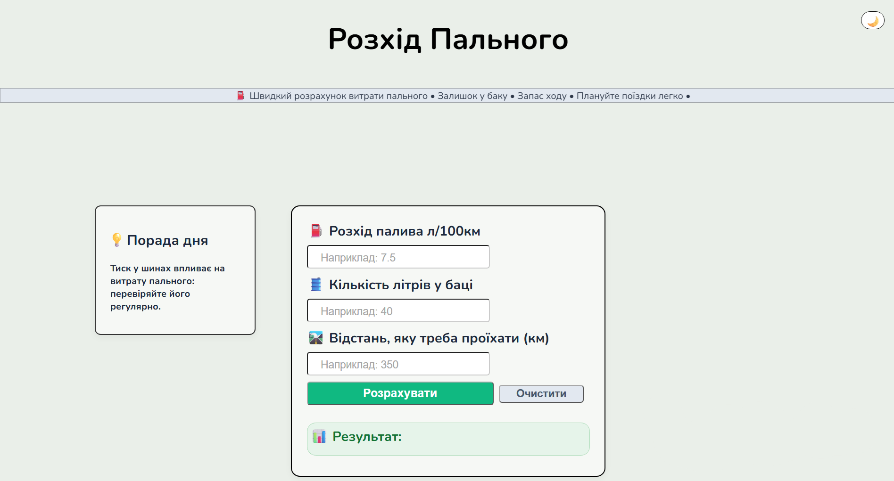
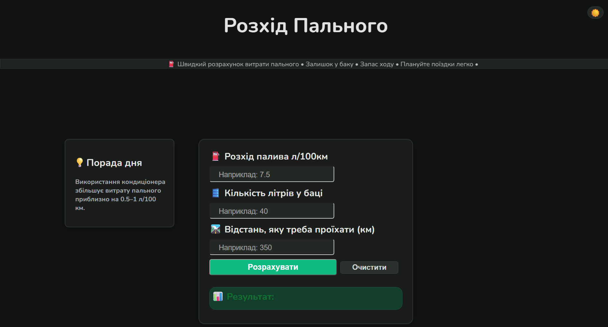

## Preview

# ⛽Fuel Calculator

A simple website that helps drivers calculate fuel consumption for a trip.

## Features

- Calculate fuel consumption
- Calculate remaining fuel in the tank
- Calculate the remaining driving range

## Technologies

- HTML
- CSS
- JavaScript

## Website Language
- Ukrainian

## Changelog

### Version [1.3] (08 September 2026)
**Added:**
- Mobile layout: Optimised for mobile devices.
- Updated main design: The colour scheme has been changed.
- New ‘Clear’ button function: Now not only the input fields but also the results field are cleared.
- New ‘Tip of the Day’ section added: This section provides tips every time you visit the page.
- Dark theme updated: Colours have been chosen to create a more harmonious look.
- Website design updated: The footer, results field, and ‘Calculate’ and ‘Clear’ buttons have been updated.

### Version [1.2] (21 July 2026)
**Added:**
- Dark theme.
- Animated information banner.
- Various changes to the UI.
- Website logo.

### Version [1.1] (19 July 2026)
**Added:**
- Animate result counter
- Clear button
- Nunito font
- UI improvements

### Version [1.0] (18 July 2026)
**Initial release:**
- Fuel consumption calculation

**Current version:** **1.3**

## Author

Created by vlad-r-dev.
