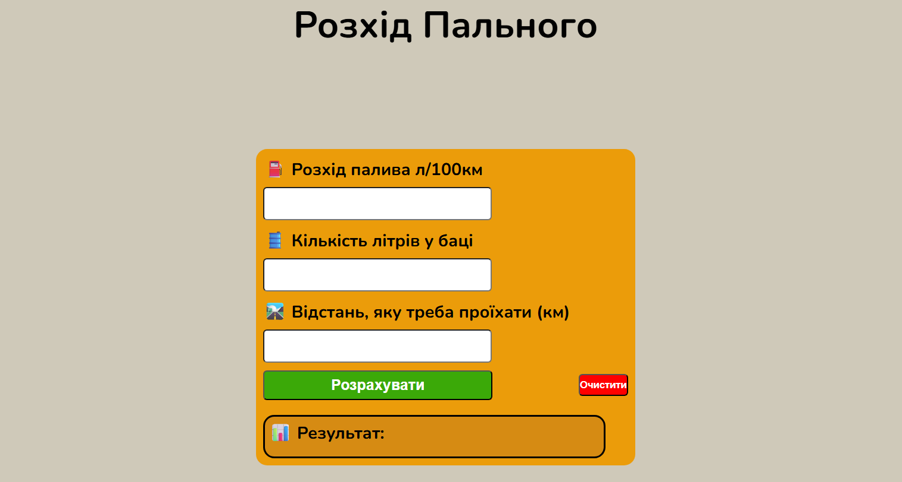

## Preview

# ⛽Fuel Calculator

A simple website that helps drivers calculate fuel consumption for a trip.

## Features

- Calculate fuel consumption
- Calculate remaining fuel in the tank
- Calculate the remaining driving range

## Technologies

- HTML
- CSS
- JavaScript

## Website Language
- Ukraine

## Changelog

### Version [1.1] (19 July 2026)
**Added:**
- Animate result counter
- Clear button
- Nunito font
- UI improvements

### Version [1.0] (18 July 2026)
**Initial release:**
- Fuel consumption calculation

**Current version:** **1.1**

## Author

Created by vlad-r-dev.
